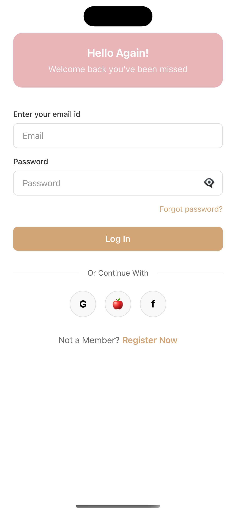
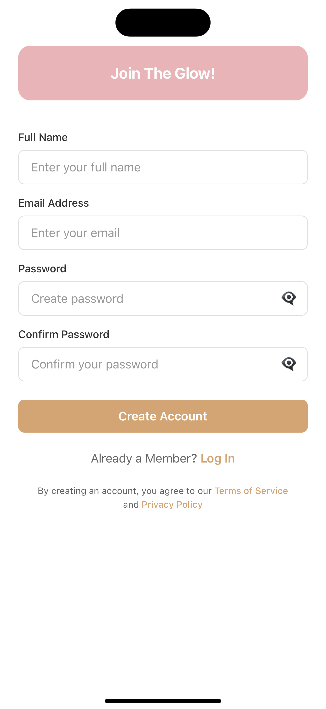
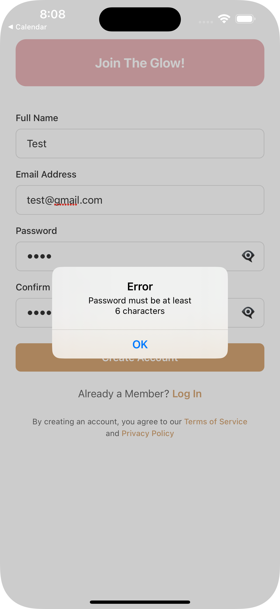
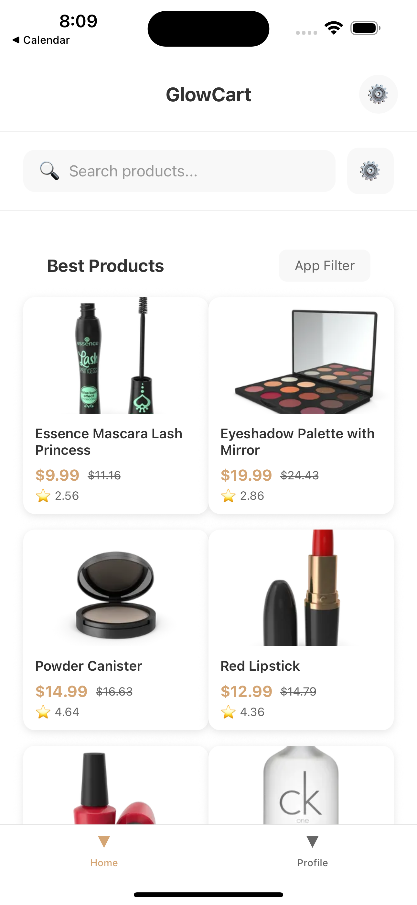
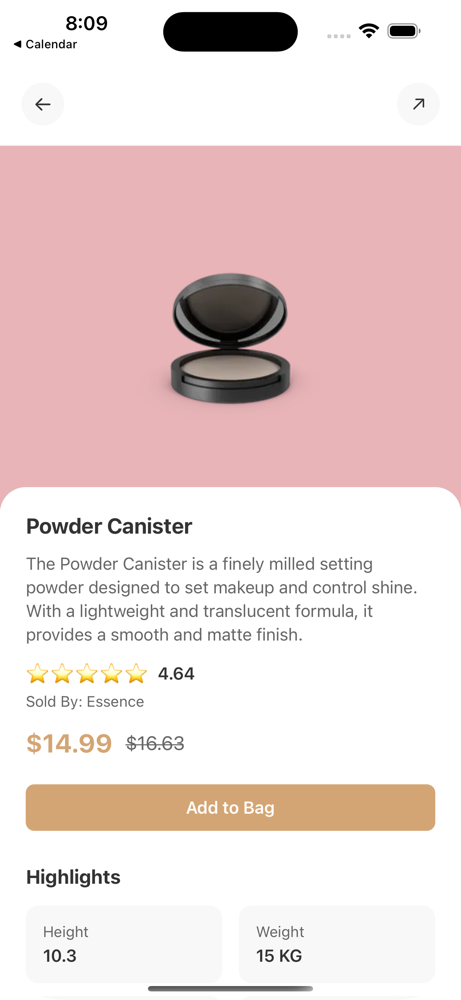
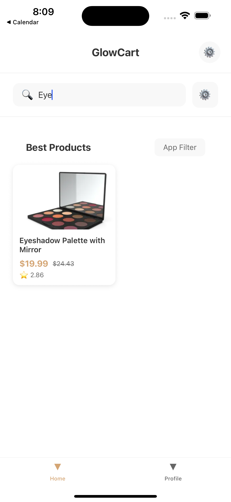
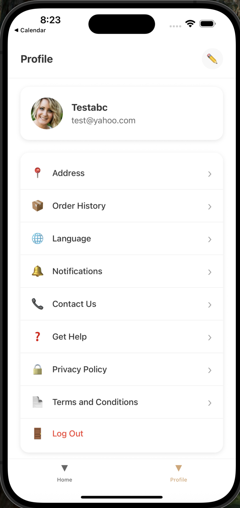

# GlowCart - Beauty E-commerce App

A modern, minimalist cosmetic e-commerce app built with React Native CLI, featuring clean architecture, smooth animations, and an intuitive user experience.

## Features

- **Onboarding Experience**: Beautiful welcome screen with compelling visuals
- **Authentication**: Login and Registration with form validation
- **Product Catalog**: Browse beauty products with search and filter functionality
- **Product Details**: Comprehensive product information with reviews and ratings
- **User Profile**: Account management and settings
- **State Management**: Efficient data handling with Zustand
- **API Integration**: Dynamic product data from DummyJSON API
- **Responsive Design**: Optimized for various screen sizes

##  Screens

1. **Onboarding Screen** - Welcome experience with brand introduction
2. **Login Screen** - User authentication with social login options
3. **Register Screen** - Account creation with form validation
4. **Home Screen** - Product catalog with search and filtering
5. **Product Details** - Detailed product view with reviews
6. **Profile Screen** - User account management and settings

##  Technical Stack

- **Framework**: React Native CLI
- **Navigation**: React Navigation v6
- **State Management**: Zustand
- **HTTP Client**: Axios
- **API**: DummyJSON (https://dummyjson.com/products)
- **Styling**: StyleSheet API
- **Icons**: Unicode emojis and text symbols

##  Prerequisites

Before running this project, make sure you have:

- Node.js (v14 or higher)
- React Native CLI
- Android Studio (for Android development)
- Xcode (for iOS development - macOS only)
- JDK 11 or higher

##  Installation & Setup

### 1. Clone the Repository

```bash
git clone <repository-url>
cd GlowCart
```

### 2. Install Dependencies

```bash
npm install
```

### 3. Install Required Packages

```bash
# Navigation dependencies
npm install @react-navigation/native @react-navigation/stack @react-navigation/bottom-tabs
npm install react-native-screens react-native-safe-area-context
npm install react-native-gesture-handler

# HTTP client
npm install axios

# State management
npm install zustand

# Optional: Vector icons
npm install react-native-vector-icons
```

### 4. iOS Setup (macOS only)

```bash
cd ios && pod install && cd ..
```

### 5. Android Setup

Make sure you have Android Studio installed and configured, then create an Android Virtual Device (AVD).

### 6. Run the Application

#### For Android:
```bash
npx react-native run-android
```

#### For iOS:
```bash
npx react-native run-ios
```


##  Design Features

- **Color Scheme**: Rose gold and cream tones for a luxurious beauty brand feel
- **Typography**: Clean, readable fonts with proper hierarchy
- **Layout**: Grid-based product display with card-style components
- **Navigation**: Intuitive tab and stack navigation
- **Feedback**: Loading states, error handling, and user confirmations

##  API Integration

The app integrates with DummyJSON API to fetch product data:

- **Base URL**: `https://dummyjson.com`
- **Products Endpoint**: `/products`
- **Search Endpoint**: `/products/search`
- **Product Details**: `/products/{id}`

Products are filtered and transformed to match cosmetic themes using keywords like "mascara", "lipstick", "foundation", etc.

##  State Management

Uses Zustand for lightweight, efficient state management:

- **Auth Store**: User authentication state
- **Product Store**: Product data, loading states, and error handling
- **Persistent State**: User session management

##  Authentication Flow

1. **Onboarding**: Welcome screen with app introduction
2. **Login**: Email/password authentication with validation
3. **Registration**: Account creation with form validation
4. **Session**: Persistent login state management

##  Key Features

### Product Catalog
- Grid layout with product cards
- Search functionality
- Filter options (UI implemented)
- Pull-to-refresh support
- Loading and error states

### Product Details
- High-quality product images
- Comprehensive product information
- Star ratings and reviews
- Add to bag functionality
- Product highlights and specifications

### User Profile
- User information display
- Settings and preferences
- Account management options
- Logout functionality

## Development Time


## Known Issues & Assumptions

### Assumptions Made:
1. **Mock Data**: Reviews and some product details are mocked for demonstration
2. **Authentication**: Login/registration is simulated (no backend integration)
3. **Icons**: Using Unicode emojis instead of vector icons for simplicity
4. **Social Login**: UI only implementation for Google/Apple/Facebook login
5. **Cart Functionality**: Add to bag shows confirmation but doesn't maintain cart state

### Known Issues:
1. **Images**: Some product images from DummyJSON may not match cosmetic themes
2. **Offline Support**: No offline caching implemented
3. **Deep Linking**: Not configured for production use
4. **Push Notifications**: Not implemented

## Future Enhancements

- [ ] TypeScript integration
- [ ] Animations and micro-interactions
- [ ] Cart and checkout functionality
- [ ] Payment integration
- [ ] Push notifications
- [ ] Offline support
- [ ] Advanced filtering and sorting
- [ ] Wishlist functionality
- [ ] Order tracking
- [ ] Product reviews submission

##  Screenshots











## Acknowledgments

- DummyJSON for providing the product API
- React Native community for excellent documentation
- Design inspiration from modern e-commerce apps

---


